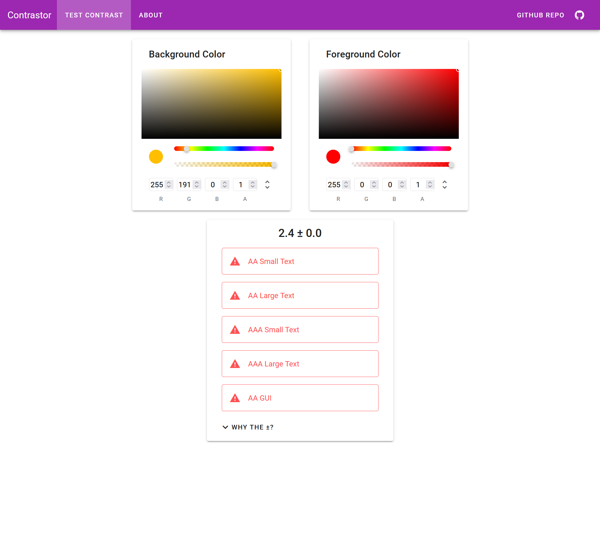

# Contrastor

Simple web app for checking contrast levels of two different colours. 



## Noteable features:

- Display WCAG contrast levels (AA/AAA, small/large text).
- RGBA, HSL, HSLA and Hex colour format support.
- Pages are server-side rendered, snazzy UX :)
- Statically generetaed.

# Development

Install the dependencies:

```sh
npm ci
```

Run the dev server:

```
npm run dev
```

## Testing and Linting

Run unit-tests using:

```
npm run test
```

And linting using:

```
npm run lint --fix
```

# Production

Build for production using:

```sh
$ npm run generate
```
